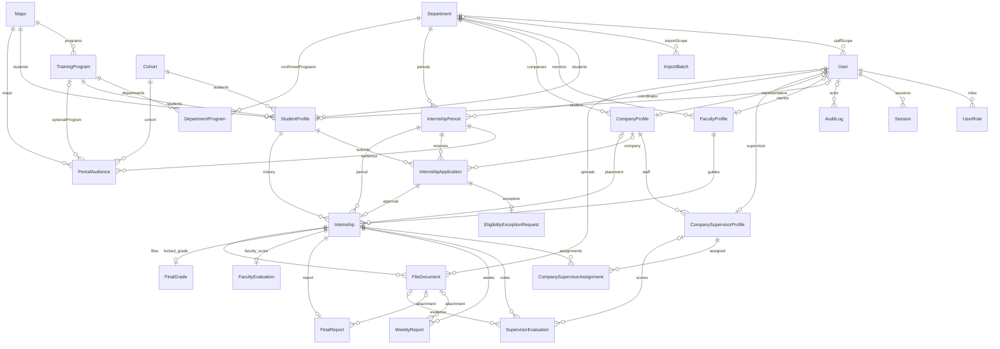

# ERD bản bàn giao

Nguồn chuẩn: `backend/prisma/schema.prisma` và 9 migration. Sơ đồ dưới là quan hệ vật lý chính; không suy diễn các trường ID trong JSON/audit là khóa ngoại.

`LoginThrottle` là bảng khóa hash và bộ đếm độc lập. `ImportBatch` lưu rows/errors JSON, trạng thái preview/confirmed và createdById; createdById là ID nghiệp vụ, không có relation FK trong Prisma hiện tại. `AuditLog.targetId/details`, `SupervisorEvaluation.enteredById`, `FileDocument.companyId/supervisorId` cũng có ID truy vết được kiểm tra ở service, không thêm đường FK giả trong sơ đồ.

Ràng buộc quan trọng:

- User email duy nhất; UserRole khóa ghép userId/role; Session chỉ lưu tokenHash.
- Hồ sơ có userId/representativeUserId duy nhất nhưng được phép chưa cấp tài khoản.
- Application duy nhất theo periodId/studentId; Internship duy nhất theo applicationId.
- Một thực tập hiệu lực/sinh viên và quota giảng viên được bảo vệ bằng transaction/row lock ở service, không phải chỉ bằng ERD hay một unique index theo studentId (vì cần giữ lịch sử nhiều đợt).
- Assignment khóa ghép internshipId/supervisorId; phiếu doanh nghiệp duy nhất theo cùng cặp; báo cáo tuần duy nhất internshipId/weekNumber.
- FacultyEvaluation/FinalReport/FinalGrade là tối đa một bản hiện tại mỗi Internship. Snapshot JSON giữ công thức/phiếu/điều kiện lúc chốt, không phụ thuộc các trường có thể thay đổi sau này.
- FileDocument chỉ lưu metadata, hash và objectKey; byte PDF nằm trong MinIO. Backup phải chứa cả hai kho.

Sơ đồ giản lược không thay thế migration khi dựng database. Trường `finalReportScore` còn vì tương thích lịch sử, không phải trọng số độc lập trong công thức 50/50.
